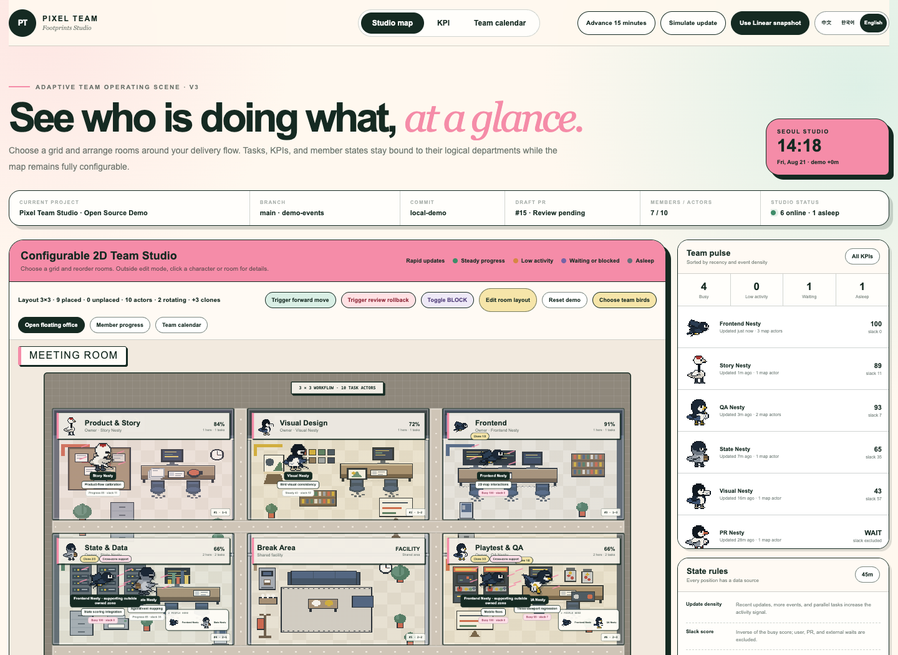

# Pixel Team Studio

> An open-source pixel office that makes AI-agent and team work visible: tasks, positions, KPIs, blockers, and schedules at a glance.

[English](README.md) · [简体中文](README.zh-CN.md)

[](https://github.com/NJ-A2A/pixel-team-studio/actions/workflows/ci.yml)
[](LICENSE)



Pixel Team Studio turns an abstract workflow into a living 2D office. The office is not tied to a fixed department map: choose a `3×3`, `2×4`, `3×2`, `1×8`, or custom grid, then arrange rooms around your delivery process.

Position is data. A member with work in one office stays there. A member with active work across several offices keeps one identity bird and rotates through those rooms; active task weight controls dwell time, while corridor transit is accounted separately.

## Features

- Configurable office grids: `3×3`, `2×4`, `3×2`, `1×8`, and custom `1–4 rows × 1–8 columns` layouts
- Swappable department slots, per-cell row/column selectors, empty rooms, an unplaced-room tray, and selectable workflow templates
- Visible corridor lanes between every row and column of offices
- Room-bound office artwork: furniture backgrounds travel with Product, Frontend, QA, Release, and every other room when layouts change
- Versioned browser persistence; moving a room never changes its logical tasks or KPIs
- Fit-to-viewport pixel-office scene that keeps the complete floor visible at every grid size
- 17 distinct animated 32×32 pixel birds, selectable manually or through a three-question team casting game
- Separate logical owners, active executors, and cross-zone support
- Weighted one-bird rotation across multiple active offices, with separate seats and a roster whenever several people share a room
- Automatic actor clones for parallel tasks
- Event-driven one-shot movement: `settled → transit → settled`, with no looping patrols
- Doorway anchors and deterministic corridor routes; no A* pathfinding required
- BLOCK actors remain still at the next doorway; review rollbacks use slower movement and a red return marker
- Transit time is tracked separately and excluded from busy/slack scoring
- Busy, steady, low-activity, waiting, blocked, and sleeping states
- Member KPIs, project metrics, task details, and a team calendar
- A dedicated compact office route, standalone pop-up, and Manifest V3 browser extension for draggable overlays or a native side panel
- An upper-left meeting room with an AI idea inbox, human-reviewed brainstorm board, Markdown/memo materials, references, and meeting-summary drafts
- Adjustable sleep thresholds, time advancement, and simulated events
- Play-first onboarding with progressive Linear connection and visible measured/estimated/no-data provenance
- Queue piles encode count and oldest wait separately; business-time flow efficiency and backlog-area rules are documented
- A unified state layer ready for Codex MCP, Hooks, GitHub webhooks, and calendar events
- Built-in Chinese, Korean, and English UI switching, shared by the full studio, compact widget, layout editor, and meeting room

## Quick start

Requires Node.js 22+ and pnpm.

```bash
git clone https://github.com/NJ-A2A/pixel-team-studio.git
cd pixel-team-studio
pnpm install
pnpm dev
```

Open the local URL printed by Vite.

Open `http://localhost:5174/?view=widget&source=linear` for the compact office only, or click **Open floating office** in the full studio. To keep it over Claude, ChatGPT, Linear, or another website, load `browser-extension/` as an unpacked Chrome/Edge extension. See [Floating Office Widget](docs/FLOATING_WIDGET.md).

## Project structure

```text
src/components/team-studio/   Page, controls, drawers, and pixel animation
src/lib/team-studio/          Members, tasks, activity scoring, layouts, and movement state
public/team-studio/           Pixel-bird and office assets
public/team-studio/office/office_layouts.json  Functional/state layout definitions and anchors
docs/REALTIME_INTEGRATION.md   MCP, Hooks, webhooks, SSE, permissions, and privacy
docs/MCP_INTEGRATION.md        Runnable Codex/Claude MCP setup and safe write-tool boundaries
docs/INGEST_LINEAR.md          Verified Linear schema, OAuth, backfill, webhooks, and flow metrics
docs/LINEAR_EXAMPLES.md        Sanitized Linear snapshot and worked transition examples
docs/FLOATING_WIDGET.md        Codex panel, standalone pop-up, and browser-extension setup
docs/MEETING_ROOM.md           AI idea intake, human review, Markdown materials, and shared-event contract
browser-extension/             Draggable overlay and Chrome/Edge side-panel shell
tests/                        State-machine and map regression tests
```

## Connect real team state

The bundled app uses interactive demo data. A production integration should normalize all sources into one event stream:

```text
Codex MCP / Codex Hooks / GitHub / Calendar
                    ↓
             Team Events API
                    ↓
              SSE / WebSocket
                    ↓
             Pixel Office UI
```

Start with the runnable [Codex/Claude MCP example](examples/mcp-server/README.md), then read [MCP integration](docs/MCP_INTEGRATION.md) for the write-approval model. [Linear worked examples](docs/LINEAR_EXAMPLES.md) includes a safe local snapshot you can open immediately; [Linear-first flow ingestion](docs/INGEST_LINEAR.md) contains the full schema, OAuth, historical backfill, and measurement contract.

### MCP + Linear in two minutes

```bash
# 1. Load fictional Linear data (the destination is intentionally gitignored)
cp public/team-studio/linear-snapshot.example.json \
   public/team-studio/linear-snapshot.local.json

# 2. Run the studio and open http://localhost:5174/?source=linear
pnpm dev

# 3. In another terminal, install and register the local MCP server
pnpm --dir examples/mcp-server install
codex mcp add pixel-team-studio -- \
  pnpm --dir "$PWD/examples/mcp-server" start
```

The MCP server exposes `team_get_state`, `team_start_task`, `team_update_progress`, `team_report_blocker`, and `team_complete_task`. It writes append-only sanitized events locally by default, or posts them to `TEAM_EVENTS_URL` in production.

## Customize

- Edit members, tasks, KPIs, and calendar events in `src/lib/team-studio/demo-data.ts`.
- Open **Edit room layout** from the map toolbar to reveal the separate layout editor; grid presets, workflow templates, the row/column matrix, and the unplaced tray stay hidden during normal monitoring.
- Edit logical responsibility zones and owners in `TEAM_ZONES`; `studio-layout.ts` generates map coordinates.
- Edit layout presets, capacity, and room sizes in `studio-layout.ts`.
- Edit the process order, doorway anchors, BLOCK behavior, and rollback rules for `model: "state"` layouts in `office_layouts.json`.
- Edit task diffs, one-shot transit routes, and accounting boundaries in `flow-motion.ts`.
- Edit adaptive actor positions in `actor-instances.ts`.
- Replace `public/team-studio/office/office-map.png` to use your own office background.
- Pixel-bird strips use the frame convention `idle 0–3 / walk 4–7 / run 8–13 / work 14–17 / sit 18–21 / sleep 22–25 / fly 26–31`.
- Use **Choose team birds** to run the short work-style casting game or select any of the 17 birds manually. Appearance choices are stored locally and do not change Linear identity or task data.
- The current asset contract remains 32×32. Extra-long beaks use the compact run/fly geometry supplied by the kit; moving to 40×40 is intentionally deferred as a breaking sprite-format change.


## Responsible use

Activity frequency is not performance. Waiting for a user, review, CI, a meeting, leave, or an external dependency must not be counted as “slacking.” Do not use this project as employee surveillance or as a single-source performance score. Never collect source code, prompts, complete terminal output, secrets, or private calendar details.

## Contributing

Issues and pull requests are welcome. See [CONTRIBUTING.md](CONTRIBUTING.md).

## License

[MIT](LICENSE) © 2026 NJ_A2A contributors.
