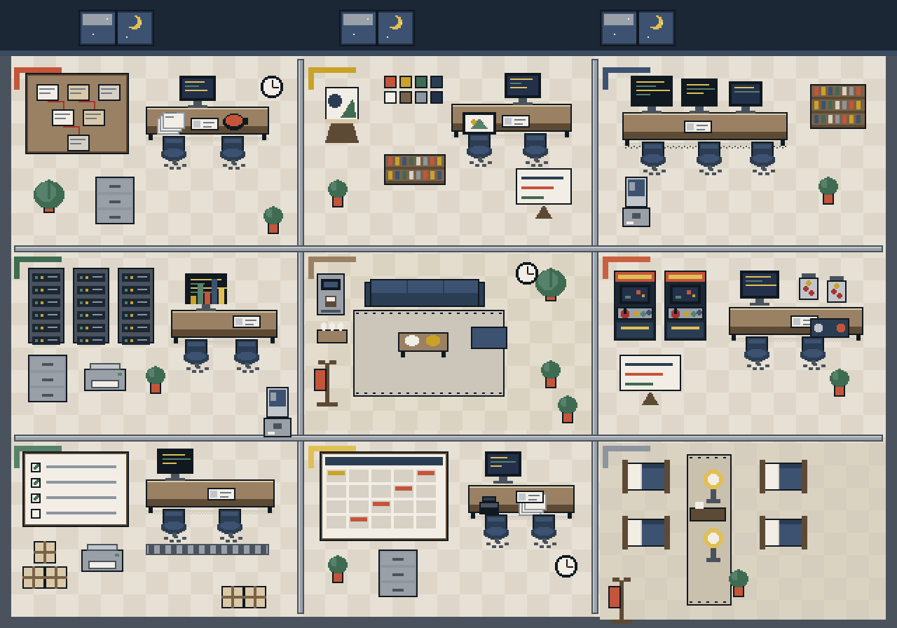
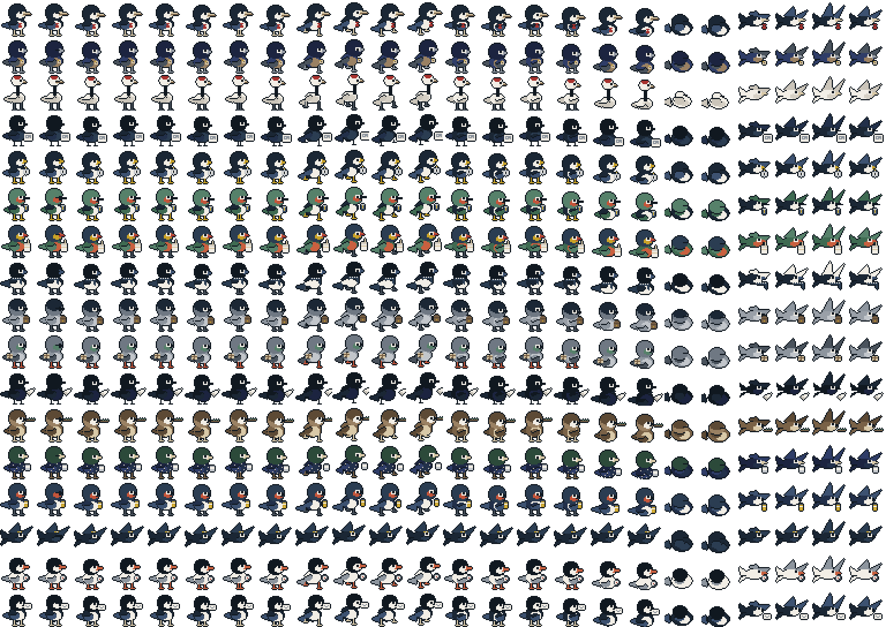

# NestLinker Team Studio

> An open-source pixel office that makes AI-agent and team work visible: tasks, positions, KPIs, blockers, and schedules at a glance.

[](https://github.com/NJforYunman/nestlinker-team-studio/actions/workflows/ci.yml)
[](LICENSE)



NestLinker Team Studio turns an abstract workflow into a living 2D office. The office is not tied to a fixed department map: choose a `3×3`, `2×4`, `3×2`, `1×8`, or custom grid, then arrange rooms around your delivery process.

Position is data. A character moves only when its task actually changes zones, follows a one-shot doorway-and-corridor route, and stops when it arrives. If the data does not change, the entire office stays still.

## Features

- Configurable office grids: `3×3`, `2×4`, `3×2`, `1×8`, and custom `1–4 rows × 1–8 columns` layouts
- Swappable department slots, empty rooms, an unplaced-room tray, and one-click workflow ordering
- Versioned browser persistence; moving a room never changes its logical tasks or KPIs
- Responsive pixel-office scene
- 17 distinct 32×32 pixel birds, each with 24 animation frames: idle, walk, run, work, sit, sleep, and fly
- Separate logical owners, active executors, and cross-zone support
- Automatic actor clones for parallel tasks
- Event-driven one-shot movement: `settled → transit → settled`, with no looping patrols
- Doorway anchors and deterministic corridor routes; no A* pathfinding required
- BLOCK actors remain still at the next doorway; review rollbacks use slower movement and a red return marker
- Transit time is tracked separately and excluded from busy/slack scoring
- Busy, steady, low-activity, waiting, blocked, and sleeping states
- Member KPIs, project metrics, task details, and a team calendar
- Adjustable sleep thresholds, time advancement, and simulated events
- A unified state layer ready for Codex MCP, Hooks, GitHub webhooks, and calendar events

## Quick start

Requires Node.js 22+ and pnpm.

```bash
git clone https://github.com/NJforYunman/nestlinker-team-studio.git
cd nestlinker-team-studio
pnpm install
pnpm dev
```

Open the local URL printed by Vite.

## Project structure

```text
src/components/team-studio/   Page, controls, drawers, and pixel animation
src/lib/team-studio/          Members, tasks, activity scoring, layouts, and movement state
public/team-studio/           Pixel-bird and office assets
public/team-studio/office/office_layouts.json  Functional/state layout definitions and anchors
docs/REALTIME_INTEGRATION.md   MCP, Hooks, webhooks, SSE, permissions, and privacy
tests/                        State-machine and map regression tests
```

## Connect real team state

The bundled app uses interactive demo data. A production integration should normalize all sources into one event stream:

```text
Codex MCP / Codex Hooks / GitHub / Calendar
                    ↓
             Team Events API
                    ↓
              SSE / WebSocket
                    ↓
             Pixel Office UI
```

See [Real-time integration](docs/REALTIME_INTEGRATION.md) for the event model, movement semantics, permissions, and privacy guidance.

## Customize

- Edit members, tasks, KPIs, and calendar events in `src/lib/team-studio/demo-data.ts`.
- Use **Edit room layout** in the app to switch grids, swap rooms, or move rooms to the unplaced tray.
- Edit logical responsibility zones and owners in `TEAM_ZONES`; `studio-layout.ts` generates map coordinates.
- Edit layout presets, capacity, and room sizes in `studio-layout.ts`.
- Edit the process order, doorway anchors, BLOCK behavior, and rollback rules for `model: "state"` layouts in `office_layouts.json`.
- Edit task diffs, one-shot transit routes, and accounting boundaries in `flow-motion.ts`.
- Edit adaptive actor positions in `actor-instances.ts`.
- Replace `public/team-studio/office/office-map.png` to use your own office background.
- Pixel-bird strips use the frame convention `idle 0–3 / walk 4–7 / run 8–11 / work 12–15 / sit 16–17 / sleep 18–19 / fly 20–23`.



## Responsible use

Activity frequency is not performance. Waiting for a user, review, CI, a meeting, leave, or an external dependency must not be counted as “slacking.” Do not use this project as employee surveillance or as a single-source performance score. Never collect source code, prompts, complete terminal output, secrets, or private calendar details.

## Contributing

Issues and pull requests are welcome. See [CONTRIBUTING.md](CONTRIBUTING.md).

## License

[MIT](LICENSE) © 2026 NJ_A2A and NestLinker contributors.
