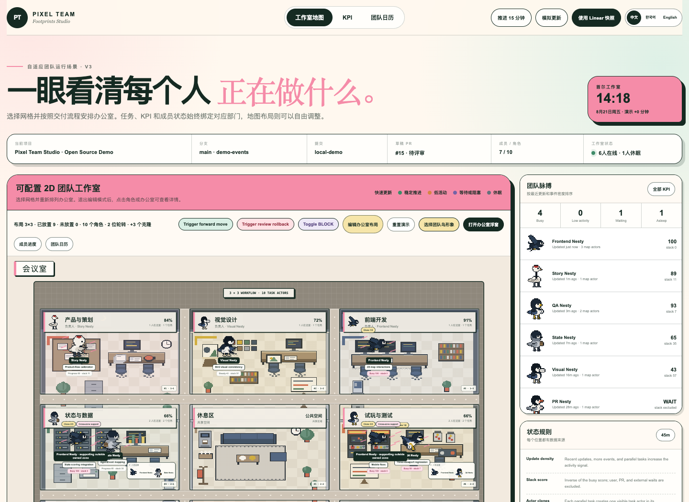

# Pixel Team Studio

> 一个开源像素办公室，用二维场景直观展示 AI Agent 和团队成员的任务、位置、KPI、阻塞与日程。

[English](README.md) · [简体中文](README.zh-CN.md)

[](https://github.com/NJ-A2A/pixel-team-studio/actions/workflows/ci.yml)
[](LICENSE)



Pixel Team Studio 把抽象工作流变成一间会动的二维办公室。部门并不固定在某个格子里：你可以选择 `3×3`、`2×4`、`3×2`、`1×8` 或自定义网格，再按照团队实际流程安排每个办公室。

在这里，位置就是数据。成员只参与一个环节时会停留在对应办公室；同时参与多个环节时，仍然只保留一只身份鸟，并根据活跃任务比例决定在各办公室的停留时间。穿过楼道的时间单独记为 `transit`，不会污染忙碌或低活动指标。

## 功能

- 可配置 `3×3`、`2×4`、`3×2`、`1×8` 以及 `1–4 行 × 1–8 列` 自定义布局
- 可交换的部门格子、按行列选择办公室、空房间、未放置房间区和多套工作流模板
- 办公室之间有独立楼道，背景与家具会跟随办公室一起移动
- 地图自动缩放，任何网格尺寸下都会完整显示工作室
- 17 种 32×32 动态像素鸟，可手动选择，也可通过三道工作风格测试分配形象
- 每位成员只有一个身份角色；多任务成员按照任务权重在办公室之间轮转
- 同一办公室有多人工作时，会同时显示所有成员并分配独立位置
- 事件驱动移动：`停留 → 移动 → 停留`，没有无意义的循环巡逻
- BLOCK 成员停在下一环节门口；评审打回会以更慢速度向上游移动并显示回退标记
- 支持忙碌、稳定、低活动、等待、阻塞和休眠状态
- 可查看成员任务、KPI、项目指标、截止日期和团队日历
- 左上角会议室包含 AI 想法收件箱、人工确认的头脑风暴墙、Markdown/memo 资料和会议小结
- 提供独立办公室浮窗，以及可覆盖网页或打开浏览器侧边栏的 Manifest V3 扩展
- 支持 Linear 渐进式接入、队列箱堆、流动效率和数据来源标记
- 完整工作室、布局编辑器、会议室和小浮窗均支持中文、韩文与英文切换
- 已为 Codex MCP、Hooks、GitHub Webhook、日历事件和实时推送预留统一状态层

## 快速开始

需要 Node.js 22+ 和 pnpm。

```bash
git clone https://github.com/NJ-A2A/pixel-team-studio.git
cd pixel-team-studio
pnpm install
pnpm dev
```

打开 Vite 输出的本地地址。

访问 `http://localhost:5174/?view=widget&source=linear` 可以只打开办公室小浮窗；也可以在完整工作室点击“打开办公室浮窗”。如果希望把它挂在 Claude、ChatGPT、Linear、GitHub 等网页上，可将 `browser-extension/` 作为未打包扩展加载到 Chrome 或 Edge。详细说明见[办公室浮窗](docs/FLOATING_WIDGET.md)。

## 目录结构

```text
src/components/team-studio/   页面、控制器、抽屉面板和像素动画
src/lib/team-studio/          成员、任务、状态评分、布局和移动逻辑
public/team-studio/           像素鸟和办公室资源
public/team-studio/office/office_layouts.json  布局、门口锚点和状态规则
docs/REALTIME_INTEGRATION.md   MCP、Hooks、Webhook、SSE、权限与隐私
docs/MCP_INTEGRATION.zh-CN.md  可运行的 Codex/Claude MCP 接入与写操作权限边界
docs/INGEST_LINEAR.md          Linear schema、OAuth、历史回填和流动指标
docs/LINEAR_EXAMPLES.zh-CN.md  脱敏 Linear 快照与状态流转示例
docs/FLOATING_WIDGET.md        Codex 面板、独立浮窗和浏览器扩展
docs/MEETING_ROOM.md           AI 想法、人工确认、资料与共享事件格式
browser-extension/             网页悬浮层和 Chrome/Edge 侧边栏扩展
tests/                         状态机与地图回归测试
```

## 接入真实团队状态

仓库默认使用交互式演示数据。生产环境可以把不同来源归一化为同一条事件流：

```text
Codex MCP / Codex Hooks / GitHub / Calendar
                    ↓
             Team Events API
                    ↓
              SSE / WebSocket
                    ↓
             Pixel Office UI
```

先运行 [Codex/Claude MCP 示例](examples/mcp-server/README.zh-CN.md)，再阅读 [MCP 接入说明](docs/MCP_INTEGRATION.zh-CN.md)了解写操作授权边界。[Linear 示例](docs/LINEAR_EXAMPLES.zh-CN.md)提供可以立即打开的脱敏快照；完整 schema、OAuth、历史回填与指标口径见[Linear 接入说明](docs/INGEST_LINEAR.md)。

### 两分钟体验 MCP + Linear

```bash
# 1. 载入虚构 Linear 数据（目标文件已被 Git 忽略）
cp public/team-studio/linear-snapshot.example.json \
   public/team-studio/linear-snapshot.local.json

# 2. 启动后打开 http://localhost:5174/?source=linear
pnpm dev

# 3. 在另一个终端安装并注册本地 MCP Server
pnpm --dir examples/mcp-server install
codex mcp add pixel-team-studio -- \
  pnpm --dir "$PWD/examples/mcp-server" start
```

示例 MCP Server 提供 `team_get_state`、`team_start_task`、`team_update_progress`、`team_report_blocker` 和 `team_complete_task`。默认只在本地追加脱敏事件；生产环境可通过 `TEAM_EVENTS_URL` 发给实时事件 API。

## 自定义

- 在 `src/lib/team-studio/demo-data.ts` 中修改成员、任务、KPI 和日历事件。
- 点击地图工具栏中的“编辑办公室布局”，调整网格、工作流、行列位置和未放置办公室。
- 在 `TEAM_ZONES` 中修改逻辑职责区与负责人。
- 在 `studio-layout.ts` 中修改布局预设、容量和房间尺寸。
- 在 `office_layouts.json` 中修改流程顺序、门口锚点、BLOCK 与回退规则。
- 在 `flow-motion.ts` 中修改任务差分、单次移动路径和统计边界。
- 替换 `public/team-studio/office/office-map.png` 即可使用自己的办公室背景。
- 像素鸟帧约定为：`idle 0–3 / walk 4–7 / run 8–13 / work 14–17 / sit 18–21 / sleep 22–25 / fly 26–31`。

## 负责任使用

更新频率不等于绩效。等待用户、评审、CI、会议、休假或外部依赖，不应被统计为“摸鱼”。请勿把本项目用作员工监控或单一绩效评分工具，也不要采集源代码、Prompt、完整终端输出、密钥或私人日历内容。

## 参与贡献

欢迎提交 Issue 和 Pull Request，具体约定见 [CONTRIBUTING.md](CONTRIBUTING.md)。

## 许可证

[MIT](LICENSE) © 2026 NJ_A2A contributors.
